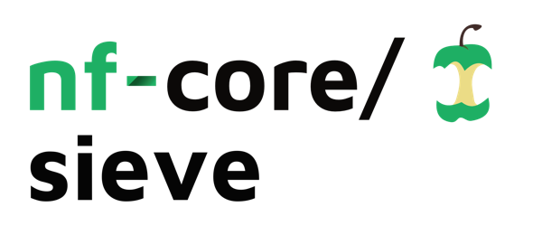

<h1>
  <picture>
    <source media="(prefers-color-scheme: dark)" srcset="docs/images/nf-core-sieve_logo_dark.png">
    
  </picture>
</h1>

[](https://github.com/codespaces/new/lescailab/sieve-nextflow)
[](https://github.com/lescailab/sieve-nextflow/actions/workflows/nf-test.yml)
[](https://github.com/lescailab/sieve-nextflow/actions/workflows/linting.yml)
[](https://nf-co.re/sieve/results)
[](https://www.nf-test.com)

[](https://www.nextflow.io/)
[](https://github.com/nf-core/tools/releases/tag/3.5.2)
[](https://docs.conda.io/en/latest/)
[](https://www.docker.com/)
[](https://sylabs.io/docs/)

## Introduction

**lescailab/sieve** runs the SIEVE (Sparse Interpretable Exome Variant Explainer) workflow for case-control variant discovery from a multi-sample VCF. The pipeline handles sex-map generation or ingestion, preprocessing, hyperparameter search, cross-validation model selection, explainability, ablation experiments, null-baseline attribution comparison, optional epistasis validation, and discovery validation outputs. Existing artifacts (sex map, preprocessed dataset, params/checkpoint configs) can be injected to skip upstream stages.

## SIEVE Workflow

1. Sex map selection or inference (`--sex_map` or `--infer_sex`)
2. Preprocessing into `preprocessed.pt` (optional skip via `--preprocessed_data`)
3. Parallel hyperparameter grid training (no CV) and best hyperparameter selection (optional skip via `--best_params` or checkpoint+config)
4. Cross-validation training with selected hyperparameters and best fold checkpoint selection (optional skip via `--best_checkpoint` + `--checkpoint_config`)
5. Explainability on best checkpoint
6. Ablation training at L0-L3 plus summary
7. Null-baseline training/explainability and attribution comparison
8. Conditional epistasis validation (only when interactions exist)
9. Discovery validation against optional external resources

## Usage

> [!NOTE]
> If you are new to Nextflow and nf-core, please refer to [nf-core installation docs](https://nf-co.re/docs/usage/installation). Validate your setup with `-profile test -stub-run` before running on real data.

Minimal run:

```bash
nextflow run lescailab/sieve-nextflow \
  -profile docker \
  --vcf cohort.vcf.gz \
  --phenotypes phenotypes.tsv \
  --genome_build GRCh38 \
  --outdir results
```

`phenotypes.tsv` format:

```tsv
sample_id	phenotype
sampleA	case
sampleB	control
```

Sex handling:

- Default: `--infer_sex true` (pipeline infers `sample_sex.tsv`)
- Optional: provide `--sex_map sample_sex.tsv` to skip inference
- If `--infer_sex false`, `--sex_map` is required

Example using a provided sex map:

```bash
nextflow run lescailab/sieve-nextflow \
  -profile docker \
  --vcf cohort.vcf.gz \
  --phenotypes phenotypes.tsv \
  --genome_build GRCh38 \
  --infer_sex false \
  --sex_map sample_sex.tsv \
  --outdir results
```

Reuse existing artifacts:

- `--preprocessed_data <dataset.pt>` skips VCF preprocessing.
- `--best_params <best_params.yaml>` skips internal grid search.
- `--best_checkpoint <checkpoint.pt> --checkpoint_config <config.yaml>` skips grid search and CV checkpoint selection, and uses the provided model directly.

Run only selected stages:

```bash
--execute_step ablation,plots
```

Allowed step names: `sex`, `preprocess`, `grid`, `cv`, `explain`, `ablation`, `null`, `epistasis`, `validation`, `plots` (comma-separated). Required upstream dependencies are executed automatically unless already satisfied by provided artifacts.

Example: ablation-only from downstream artifacts

```bash
nextflow run lescailab/sieve-nextflow \
  -profile docker \
  --preprocessed_data assets/testdata/small_reprocessed_test.pt \
  --sex_map assets/testdata/sex_map.tsv \
  --best_params assets/testdata/test_model/L3_run/config.yaml \
  --best_checkpoint assets/testdata/component_fixtures/cv/cv_output/fold_1/best_model.pt \
  --checkpoint_config assets/testdata/test_model/L3_run/config.yaml \
  --execute_step ablation \
  --outdir results
```

For additional options and schema-derived parameter docs, see:

- [docs/usage.md](docs/usage.md)
- [nf-core parameter docs](https://nf-co.re/sieve/parameters)

## Pipeline output

See [docs/output.md](docs/output.md) for output directory structure and file descriptions.

## Credits

lescailab/sieve was originally written by Francesco Lescai.

## Contributions and Support

If you would like to contribute to this pipeline, please see the [contributing guidelines](.github/CONTRIBUTING.md).

For help, contact the [nf-core Slack `#sieve` channel](https://nfcore.slack.com/channels/sieve) (join via [nf-co.re/join/slack](https://nf-co.re/join/slack)).

## Citations

References for SIEVE, nf-core, Nextflow, and packaging/container tooling are listed in [CITATIONS.md](CITATIONS.md).

You can cite the nf-core framework publication as follows:

> **The nf-core framework for community-curated bioinformatics pipelines.**
>
> Philip Ewels, Alexander Peltzer, Sven Fillinger, Harshil Patel, Johannes Alneberg, Andreas Wilm, Maxime Ulysse Garcia, Paolo Di Tommaso & Sven Nahnsen.
>
> _Nat Biotechnol._ 2020 Feb 13. doi: [10.1038/s41587-020-0439-x](https://dx.doi.org/10.1038/s41587-020-0439-x).
