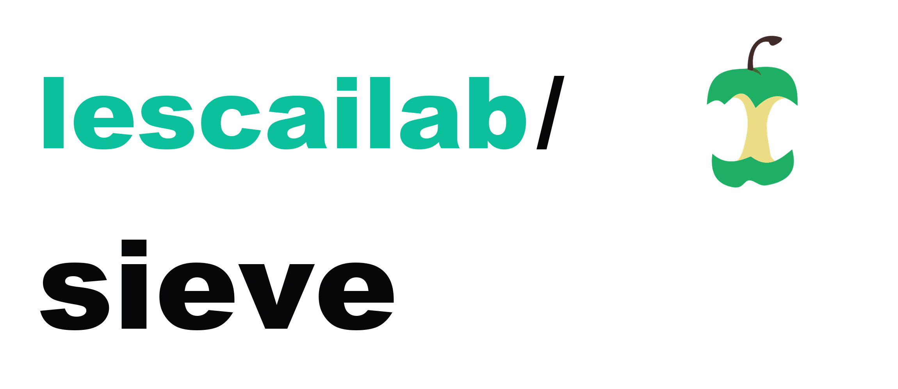

<h1>
  <picture>
    <source media="(prefers-color-scheme: dark)" srcset="assets/lescailab-sieve_logo_dark.png">
    
  </picture>
</h1>

[](https://github.com/codespaces/new/lescailab/sieve-nextflow)
[](https://github.com/lescailab/sieve-nextflow/actions/workflows/nf-test.yml)
[](https://github.com/lescailab/sieve-nextflow/actions/workflows/linting.yml)
[](https://nf-co.re/sieve/results)
[](https://www.nf-test.com)

[](https://www.nextflow.io/)
[](https://github.com/nf-core/tools/releases/tag/3.5.2)
[](https://docs.conda.io/en/latest/)
[](https://www.docker.com/)
[](https://sylabs.io/docs/)

## Introduction

**lescailab/sieve** runs a SIEVE workflow for case-control variant discovery from a bgzipped, indexed, multi-sample VCF. It prepares or ingests sex metadata, preprocesses variants and phenotypes, trains and selects models, generates explainability outputs, compares real and null attributions, and can run ablation, epistasis, validation, and plot-collection steps.

## Quick start

Run a local smoke test with bundled data and stubbed process scripts:

```bash
nextflow run lescailab/sieve-nextflow \
  -profile test \
  -stub-run \
  --outdir results_stub
```

From a local checkout, replace `lescailab/sieve-nextflow` with `.`.

## Minimal inputs

For a raw-input analysis, provide:

- `--vcf`: bgzipped multi-sample VCF ending in `.vcf.gz`, with a sibling `.tbi` or `.csi` index
- `--phenotypes`: phenotype TSV accepted by `sieve-preprocess`
- `--genome_build`: `GRCh37` or `GRCh38`
- sex metadata, either inferred from the VCF with the default `--infer_sex true`, or supplied with `--sex_map`

## Example command

The training steps use `--train_device cuda` by default. Use a GPU-enabled profile for production runs, or override the training device deliberately.

```bash
nextflow run lescailab/sieve-nextflow \
  -profile docker,gpu \
  --vcf /path/to/data.vcf.gz \
  --phenotypes /path/to/phenotypes.tsv \
  --genome_build GRCh38 \
  --outdir results
```

## Execution modes

The pipeline supports three top-level modes for the training side of the workflow:

1. **Grid search + cross-validation (default).** The Cartesian product of `--grid_lr × --grid_lambda_attr × --grid_latent_dim × --grid_hidden_dim × --grid_num_attention_layers` is trained, the best hyperparameters are picked, and a `--cv_folds`-fold cross-validation produces the final checkpoint.
2. **Fixed hyperparameters + cross-validation.** Skip the grid by supplying all three of `--train_lr`, `--train_lambda_attr`, and `--train_latent_dim` on the command line. The pipeline materialises a synthetic `best_params.yaml` and runs CV directly.
3. **Fixed hyperparameters + single training (no CV).** Same as mode 2, plus `--cv_folds 1` (or `--cv_folds 0`). The main model is trained once with `--val_split` as the train/validation split.

```bash
# Mode 2: skip grid, keep CV
nextflow run lescailab/sieve-nextflow -profile docker,gpu \
  --vcf data.vcf.gz --phenotypes pheno.tsv --genome_build GRCh38 \
  --train_lr 1e-4 --train_lambda_attr 0.1 --train_latent_dim 64

# Mode 3: skip grid AND skip CV
nextflow run lescailab/sieve-nextflow -profile docker,gpu \
  --vcf data.vcf.gz --phenotypes pheno.tsv --genome_build GRCh38 \
  --train_lr 1e-4 --train_lambda_attr 0.1 --train_latent_dim 64 \
  --cv_folds 1
```

## Top-k gene / variant selection

After null-baseline comparison, delta-rank derived from bootstrap-resampled null attributions (`sieve-bootstrap-null-calibration`) is the primary engine for top-k gene and top-k variant selection. The main-branch run publishes `gene_list_by_delta_rank.tsv`, `gene_list_by_z_attribution.tsv` (secondary diagnostic), and `variant_significance_rankings.csv` under `<cohort>/discovery/`. Tune the engine via `--bootstrap_top_k`, `--bootstrap_gene_delta_rank_aggregation`, `--bootstrap_exclude_sex_chroms`, and `--bootstrap_min_variants_per_gene`.

## Documentation

- [Usage](docs/usage.md): verified parameters, profiles, and common execution patterns
- [Output](docs/output.md): published output directories and key files
- [Guidelines](guidelines/index.md): in-depth MkDocs Material documentation for concepts, workflow steps, troubleshooting, and extension work

## Credits

lescailab/sieve was originally written by Francesco Lescai.

## Contributions and support

See the [contributing guidelines](.github/CONTRIBUTING.md). For help, use the [nf-core Slack `#sieve` channel](https://nfcore.slack.com/channels/sieve) after joining via [nf-co.re/join/slack](https://nf-co.re/join/slack).

## Citations

References for SIEVE, nf-core, Nextflow, and packaging/container tooling are listed in [CITATIONS.md](CITATIONS.md).
